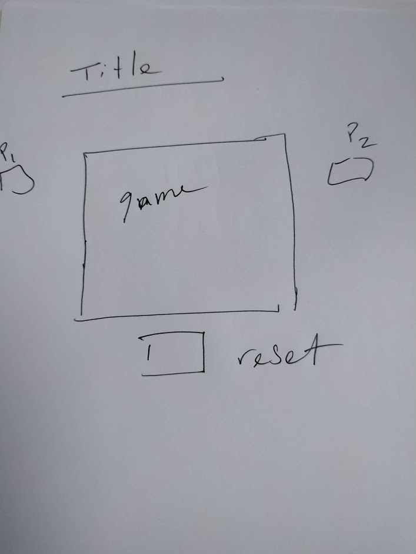

# OthelloV3
This Othello Game was made over the Course of a week .
Sunday was spent creating the css and html for the game 
first thing did was create a wireframe.

Monday I wrote all events that took place within the game but I was running into a problem of not really being sure how to keep track of the  data structure and the game board and connecting all the events together 
It is here where I would like to acknowledge that Monday Tuesday and Wednesday night I spent  with my neighbors kyle and rajetah (kyle works at google , rajetah works at amazon ) I made them dinner and they helped me code cumulatively they probably helped me for 9 hours 
Without them I doubt I would have had a finished this project. 

# HOW TO PLAY 

For the first four moves, the players must play to one of the four squares in the middle of the board and no pieces are captured or reversed.

Each piece played must be laid adjacent to an opponent's piece so that the opponent's piece or a row of opponent's pieces is flanked by the new piece and another piece of the player's colour. All of the opponent's pieces between these two pieces are 'captured' and turned over to match the player's colour.

It can happen that a piece is played so that pieces or rows of pieces in more than one direction are trapped between the new piece played and other pieces of the same colour. In this case, all the pieces in all viable directions are turned over.

The game is over when neither player has a legal move (i.e. a move that captures at least one opposing piece) or when the board is full.

# MUCH GRATITUDE TO 

* kyle
* Rajetah
* Steve ,
* Mike,
* Carlo,
* Garrett
 * pingyi
* GA design class

**Sources I looked at**
pratically all versions of Othello on Codepen
https://codepen.io/k44/pen/zKiIo
 Helped me  understand the math's behind othello
 making div's as the grid

 https://codepen.io/t-yi/pen/KoMyvo
 this is a REALLY COOL VERSION OF OTHELLO 
 I Took the gif they used as a indicator of a valid spot

 https://raw.githubusercontent.com/t1m1t/othello/master/images/allowed_pic.gif
^^^^^^^^^^^^^^^^^^^^^^^^^^^
 This is the gif  i took from the codepen  

https://codepen.io/nakyos/pen/EmXBYv

I spent A while just combing through this code and trying to uderstand how the AI worked ,
it also happens to be the BEST VERSION OF OTHELLO IN CODEPEN
I CANT BELIEVE HIS IS ONLY 334 Lines of javascript code 

For starters when I was calling my variables at the start of the JavaScript I was using get element by class and get element by ID when I should have been using query selector and query selector all 
I noticed couple of othello games had an array that contained eight different arrays.and that's how it came up with the idea of making 8 different functions to model the board.
My Wednesday afternoon I was practically done or at least that's what I thought in a section of the code I was using text content and when I switched it to inner HTML and it started working 
I reached MVP Wednesday afternoon , and Wednesday night i I was able to code out the logic behind the AI.
Thursday morning my sister play the game her only comment was that she wished that there was an easy mode , if I had more time I would 
Probably write another div at the start of the game that would display a  button that would allow the user  to switch between easy and hard mode. The most difficult part of this for me was paying attention to my indentations,and syntax goes more than once or something simple was ruining the whole game that took me awhile to figure out the problem. 
